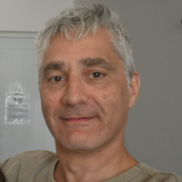
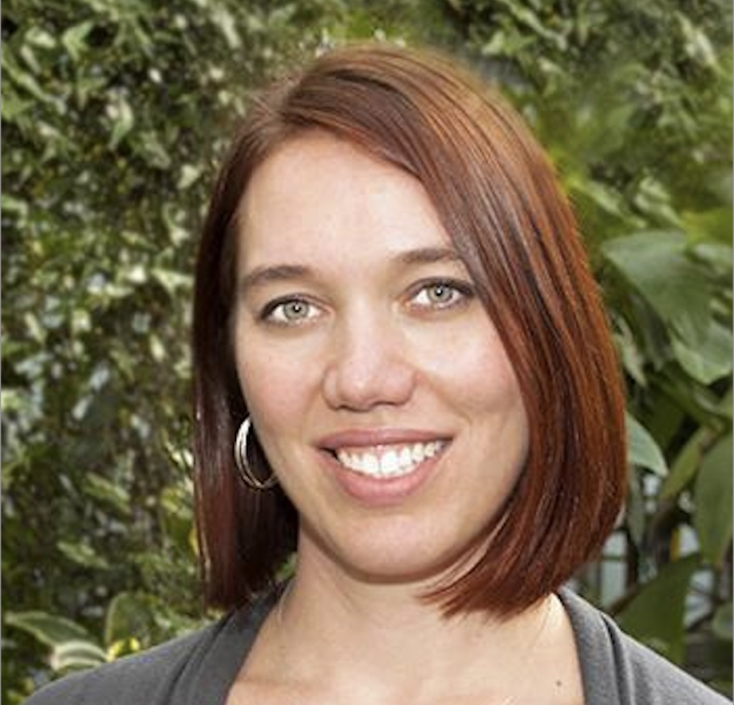

# Computational Skills For Biological Data

## EEOB/BCB 546 at Iowa State University

With the advent of big data across a number of sub-disciplines within biology, there is an increasing need for biologists to be comfortable and
competent with command-line data processing and analysis. This course will develop basic skills necessary for biologists working with big data sets.
Topics will include UNIX commands, scripting in R and Python, version control using Git and GitHub, use of high performance computing clusters, and writing effective data-management plans. These topics
will be taught using a combination of lectures and computational exercises.

<a href="https://github.com/EEOB-BioData/BCB546_Spring2025/blob/main/documents/syllabus_s2025.md"><button type="button" class="btn btn-primary">Course Syllabus</button></a>

### Spring 2025 Time and Location

Wednesday and Friday, 1:10-2:30 PM, Bessey Hall 0030 
<!-- VIRTUAL <a href="https://canvas.iastate.edu/courses/79905/pages/zoom-sessions"><i class="fas fa-video"></i></a> All Zoom links will be posted on <a href="https://canvas.iastate.edu/courses/79905/pages/zoom-sessions">Canvas</a> -->

### Instructors

<table>
  <tbody>
    <tr>
      <td>
<a href="http://www.zeagenomics.org"><b>Matt Hufford</b></a> <a href="mailto:mhufford@iastate.edu"><i class="fa fa-envelope"></i></a> <a href="https://github.com/mbhufford"><i class="fa-brands fa-github-alt"></i></a> <a href="https://twitter.com/mbhufford"><i class="fa-brands fa-twitter"></i></a> 
</td>
      <td>
<a href="https://sites.google.com/site/dennislavrov/"><b>Dennis Lavrov</b></a> <a href="mailto:dlavrov@iastate.edu"><i class="fa fa-envelope"></i></a> <a href="https://github.com/dlavrov"><i class="fa-brands fa-github-alt"></i></a> <a href="https://bsky.app/profile/dlavrov.bsky.social"><i class="fa-brands fa-bluesky"></i></a> 
</td>
      <td>
<a href="https://www.eeob.iastate.edu/people/corrinne-grover"><b>Corrinne Grover</b></a> <a href="mailto:corrinne@iastate.edu"><i class="fa fa-envelope"></i></a> <a href="https://github.com/iamcorrinne"><i class="fa-brands fa-github-alt"></i></a> <a href="https://x.com/CorrinneGrover"><i class="fa-brands fa-twitter"></i></a> 
</td>
    </tr>
  </tbody>
</table>

